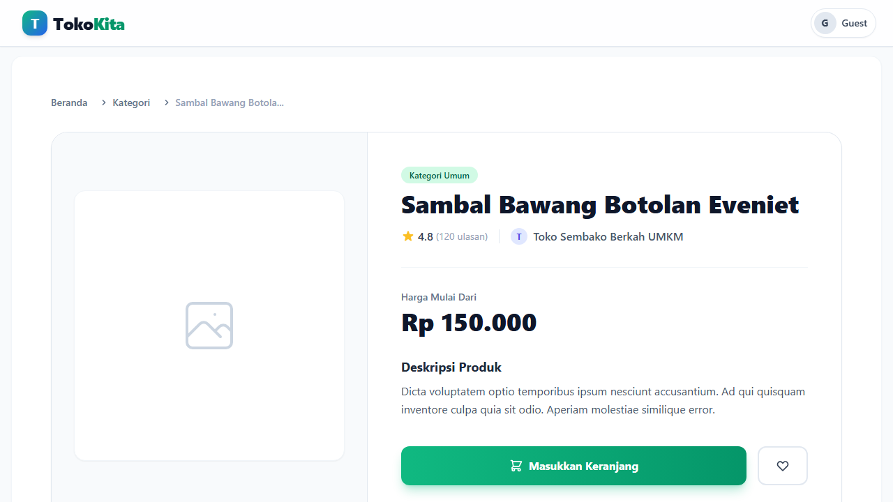
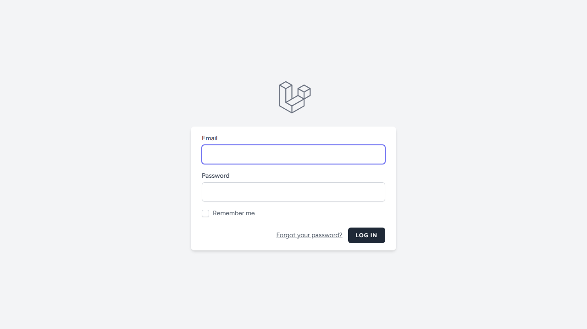

# TokoKita - Platform E-Commerce Modern

TokoKita adalah platform *e-commerce* mutakhir berarsitektur *Multi-Vendor* yang dirancang untuk mempertemukan pembeli dan penjual dalam satu ekosistem terpadu. Sistem ini dilengkapi dengan manajemen stok canggih berbasis varian, dasbor analitik waktu-nyata, dan sistem *checkout* terintegrasi.

---

## 🚀 Fitur Unggulan

- **Role-Based Access Control (RBAC)**: Tiga peran utama (Admin, Penjual, Pembeli) dengan hak akses terisolasi.
- **Manajemen Inventaris Multi-Varian**: Sistem inventaris level industri (mendukung variasi seperti Warna dan Ukuran dengan stok independen).
- **Checkout & State Machine**: Alur pemesanan ketat (`Menunggu -> Dibayar -> Diproses -> Dikirim -> Selesai`) untuk menghindari manipulasi status.
- **Dasbor KPI Real-Time**: Laporan penjualan dan pergerakan transaksi divisualisasikan dengan **Chart.js**.
- **Ekspor Dokumen**: Laporan performa dapat diunduh dalam format PDF (DomPDF) dan Excel (Laravel Excel).
- **Integrasi API Eksternal**: Siap terhubung dengan Midtrans (Payment Gateway) dan RajaOngkir (Logistik).

---

## 💻 Tumpukan Teknologi (Tech Stack)

Sistem ini dibangun di atas fondasi teknologi *open-source* modern:

| Bagian | Teknologi |
| --- | --- |
| **Kerangka Kerja (Framework)** | Laravel 10 (PHP 8.2+) |
| **Basis Data** | MySQL 8.0+ |
| **Tampilan (Frontend)** | Blade Template Engine, Tailwind CSS, Alpine.js |
| **Visualisasi Data** | Chart.js |
| **Pengujian E2E (E2E Testing)** | Microsoft Playwright |

---

## 📸 Cuplikan Layar (Screenshots)

*Beberapa cuplikan antarmuka utama aplikasi (Setelah Anda melakukan seed data):*

### 1. Halaman Beranda (Katalog Publik)


#### Katalog Kategori


#### Katalog Produk Terlaris


### 2. Detail Produk


### 3. Halaman Autentikasi


### 4. Dasbor Admin


### 5. Dasbor Penjual (Seller)


---

## 🛠️ Panduan Instalasi (Development)

Ikuti langkah-langkah di bawah ini untuk menjalankan aplikasi di lingkungan lokal Anda:

1. **Kloning Repositori**
   ```bash
   git clone https://github.com/[username_anda]/TokoKita.git
   cd TokoKita
   ```

2. **Instalasi Dependensi PHP & Node**
   ```bash
   composer install
   npm install
   ```

3. **Pengaturan Lingkungan (.env)**
   Salin berkas *environment* bawaan dan *generate* kunci aplikasi:
   ```bash
   cp .env.example .env
   php artisan key:generate
   ```
   > **Penting**: Sesuaikan `DB_DATABASE`, `DB_USERNAME`, dan `DB_PASSWORD` di `.env` dengan konfigurasi lokal Anda.

4. **Migrasi dan *Seeding* Basis Data**
   *Compile* aset *frontend* dan siapkan struktur data:
   ```bash
   npm run build
   php artisan migrate:fresh --seed
   ```

5. **Jalankan Server**
   ```bash
   php artisan serve
   ```
   Aplikasi kini dapat diakses di `http://localhost:8000`.

---

## 🧪 Panduan Pengujian (Playwright E2E)

Proyek ini dilengkapi dengan skenario *End-to-End* (E2E) menggunakan Playwright untuk menjaga keandalan sistem.

1. **Instalasi Playwright Browser**
   ```bash
   npx playwright install
   ```

2. **Jalankan Uji Coba**
   Pastikan *server* lokal (`php artisan serve`) sedang menyala, lalu buka terminal baru:
   ```bash
   npx playwright test
   ```

3. **Lihat Laporan Interaktif**
   ```bash
   npx playwright show-report
   ```

---

## 👨‍🎓 Identitas Penulis

Dokumen dan aplikasi ini dikembangkan sebagai bagian dari Tugas Akhir / Skripsi.

- **Nama**: [Muhammad Riduan]
- **NIM**: [2210010017]
- **Program Studi**: [Teknik Informatika]
- **Email Akademik**: [riduanm500@gmail.com]

---
*Dilisensikan di bawah [MIT License](LICENSE).*
