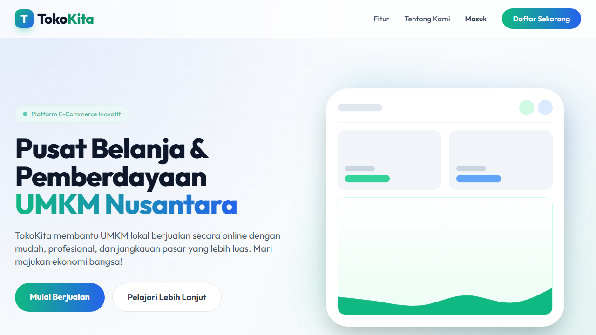
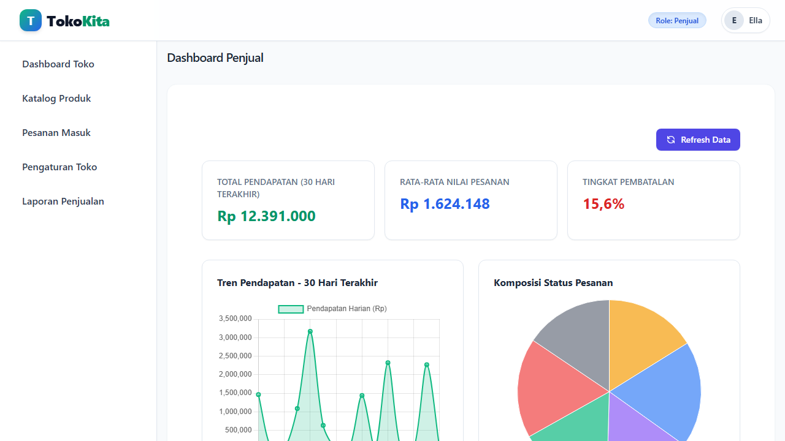
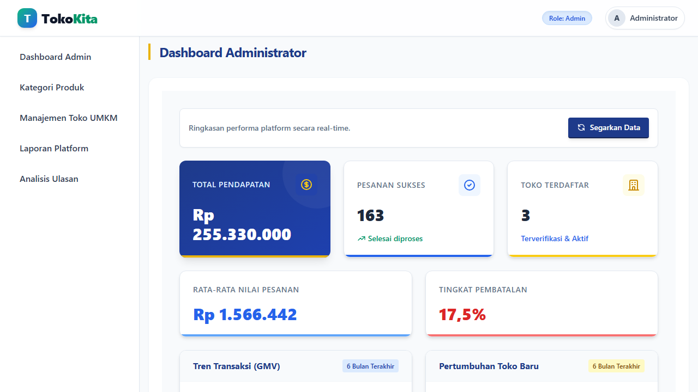
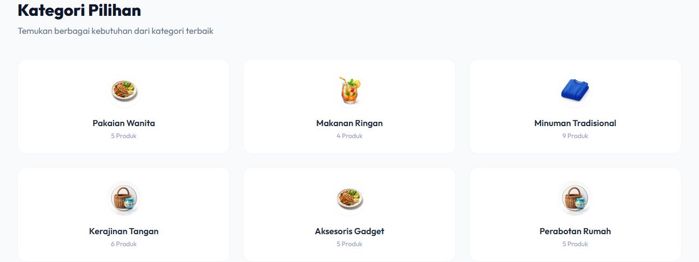

# TokoKita

**TokoKita** adalah sebuah platform aplikasi web *e-commerce* yang dirancang khusus untuk mendukung pelaku Usaha Mikro, Kecil, dan Menengah (UMKM). Platform ini memungkinkan pemilik usaha kecil untuk mendigitalkan bisnis mereka dengan membuka toko online, mengelola inventaris, memproses pesanan, dan menerima pembayaran secara terintegrasi.



## 📌 Fitur Utama

Sistem ini melibatkan tiga jenis pengguna utama:

### 👤 1. Pembeli (Customer)
- **Autentikasi & Profil**: Registrasi, login, dan manajemen profil pembeli beserta alamat pengiriman.
- **Pencarian & Katalog Produk**: Mencari produk, melihat detail produk dengan varian (warna, ukuran, dll).
- **Keranjang & Checkout**: Menambahkan produk ke keranjang belanja dan melakukan proses checkout. Terintegrasi dengan **API RajaOngkir** untuk penghitungan tarif logistik.
- **Pembayaran**: Terintegrasi dengan **Midtrans Payment Gateway**.
- **Pelacakan & Ulasan**: Memantau status pesanan dan memberikan rating/ulasan pada produk.

### 🏪 2. Penjual (Pemilik UMKM)
- **Manajemen Toko**: Mendaftar dan mengelola profil toko.
- **Manajemen Produk**: Mengelola data produk beserta varian (stok dan harga).
- **Manajemen Pesanan**: Menerima pesanan, mengubah status pesanan (Diproses, Dikirim), dan memasukkan resi pengiriman.
- **Laporan & Analitik**: Dasbor penjualan, laporan produk terlaris, rekapitulasi penjualan, laporan pelanggan loyal, dan pencetakan invoice (PDF/Excel).




### 👨‍💻 3. Administrator
- **Dashboard Utama**: Ringkasan data keseluruhan platform (total pengguna, toko, transaksi).
- **Manajemen**: Validasi pendaftaran toko dan mengelola data kategori master.




## 🛠️ Tumpukan Teknologi (Tech Stack)

- **Backend**: Laravel 10 (PHP)
- **Database**: MySQL
- **Frontend**: Blade Templating, HTML, CSS, JavaScript, Tailwind CSS
- **Testing**: Playwright (E2E Testing)
- **Integrasi Pihak Ketiga**: Midtrans (Pembayaran), RajaOngkir (Pengiriman)

## 🚀 Langkah Instalasi

Ikuti langkah-langkah di bawah ini untuk menjalankan aplikasi di lingkungan pengembangan lokal (localhost):

1. **Clone repositori ini:**
   ```bash
   git clone https://github.com/Ridwan7826/toko-umkm-app.git
   cd toko-umkm-app
   ```

2. **Instal dependensi PHP (Composer):**
   ```bash
   composer install
   ```

3. **Instal dependensi Node.js (NPM):**
   ```bash
   npm install
   ```

4. **Konfigurasi Environment:**
   Salin file konfigurasi contoh lalu sesuaikan kredensial database Anda.
   ```bash
   cp .env.example .env
   ```
   Buka file `.env` dan atur konfigurasi `DB_DATABASE`, `DB_USERNAME`, `DB_PASSWORD`.
   Masukkan juga kredensial API Midtrans dan RajaOngkir Anda.

5. **Generate Application Key:**
   ```bash
   php artisan key:generate
   ```

6. **Migrasi dan Seed Database:**
   (Pastikan database kosong sudah dibuat di MySQL)
   ```bash
   php artisan migrate --seed
   ```

7. **Buat Symlink untuk Storage Gambar:**
   ```bash
   php artisan storage:link
   ```

8. **Jalankan Aplikasi:**
   Buka dua terminal terpisah.
   
   Terminal 1 (Menjalankan Vite untuk *assets* frontend):
   ```bash
   npm run dev
   ```

   Terminal 2 (Menjalankan server PHP):
   ```bash
   php artisan serve
   ```

Aplikasi sekarang dapat diakses di `http://127.0.0.1:8000`.

## 🧪 Menjalankan Pengujian E2E (Playwright)

Proyek ini dilengkapi dengan skenario pengujian *End-to-End* menggunakan Playwright.

1. **Jalankan pengujian:**
   ```bash
   npx playwright test
   ```

2. **Lihat laporan hasil pengujian:**
   ```bash
   npx playwright show-report
   ```

## 🎓 Informasi Penulis
Aplikasi ini dikembangkan sebagai bagian dari Tugas Akhir/Skripsi.
- **Nama**: [Nama Anda]
- **NIM**: [NIM Anda]
- **Program Studi**: [Program Studi Anda]
- **Email Akademik**: [Email Akademik Anda]

---
*Dibuat dengan ❤️ untuk kemajuan UMKM Indonesia.*
